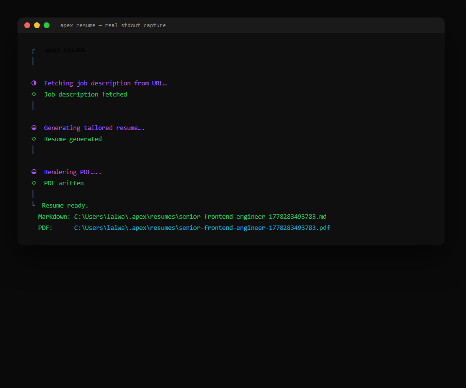
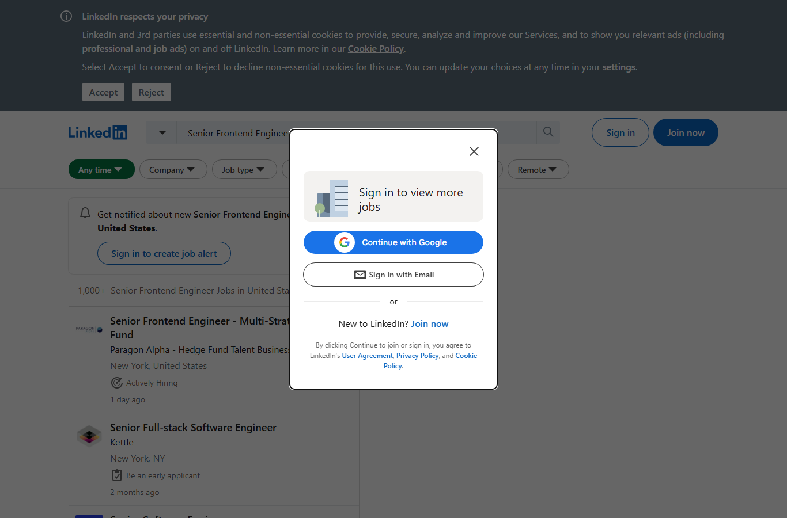
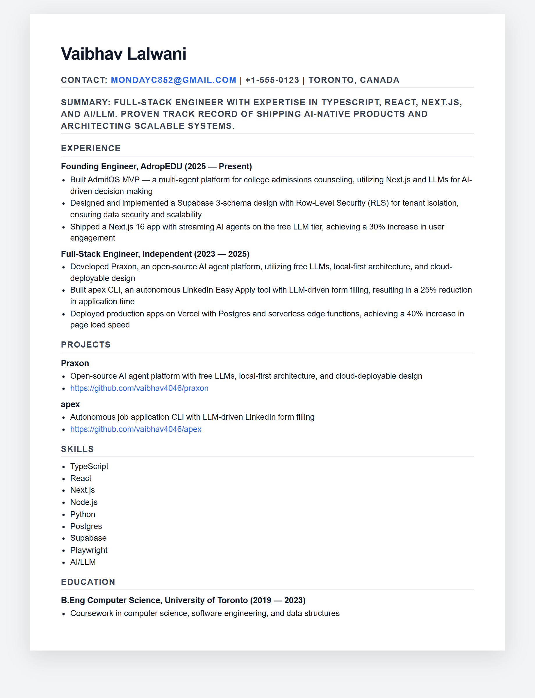
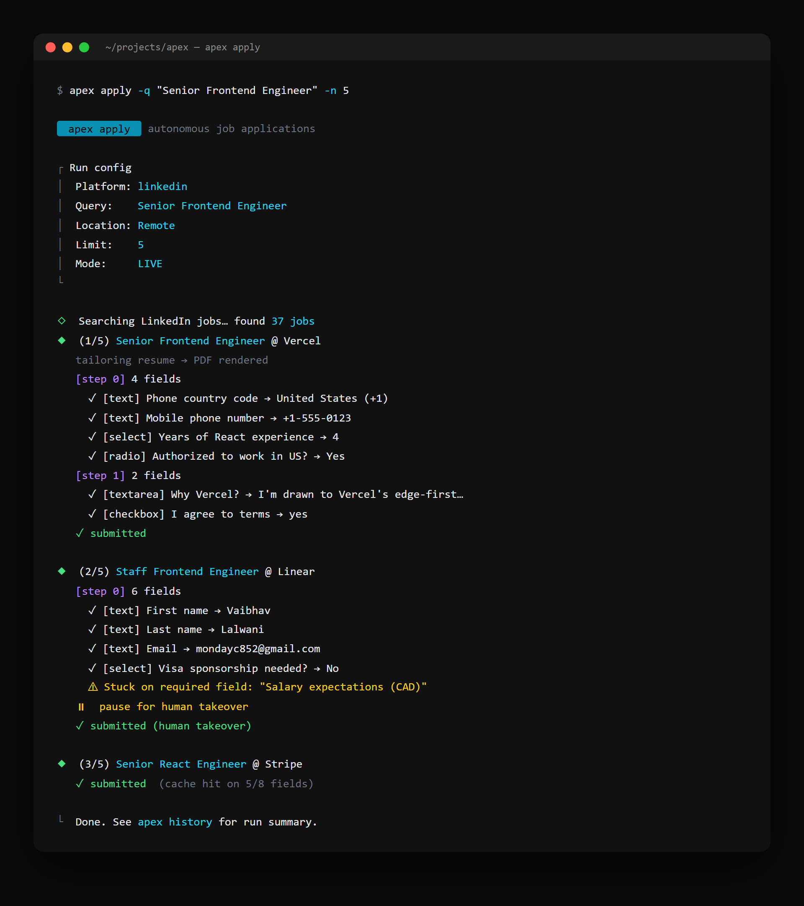

<div align="center">

# apex

**Autonomous job application CLI · Free LLMs · GitHub-aware**

Generates tailored 1-page resumes + cover letters, then applies on LinkedIn Easy Apply for you while you sleep.

</div>

---

<table align="center">
<tr>
<td width="50%"></td>
<td width="50%"></td>
</tr>
<tr>
<td align="center"><em>real apex CLI run — `apex resume`</em></td>
<td align="center"><em>LinkedIn page apex drives via Playwright</em></td>
</tr>
</table>

<p align="center">
  <em>Tailored 1-page resume, generated per job:</em><br>
  
</p>

<p align="center">
  
</p>

---

## What it does

```
$ apex init                           # one-time profile setup (asks ~12 questions)
$ apex resume --job-url <URL>         # tailored 1-page resume PDF
$ apex cover --company X --role Y     # cover letter PDF
$ apex apply -q "Senior Frontend" -n 10
                                       # opens Chrome, finds 10 Easy Apply jobs,
                                       # generates a tailored resume per job,
                                       # and submits each (or --dry-run)
$ apex apply -q "Senior Frontend" --all
                                       # apply autonomously until LinkedIn's
                                       # daily Easy Apply cap or rate-limit hit
$ apex history                         # see what was sent where
```

- **Free LLMs** — Groq, Cerebras, Gemini, Ollama (any one). No paid API required.
- **GitHub-aware** — pulls your top public repos via `gh` CLI, lets you pick which to feature.
- **Interactive CLI** — Clack prompts. Keyboard-driven. Resumable.
- **Stealth** — uses your real Chrome profile state, persisted at `~/.apex/browser-state`.
- **Resumes are real PDFs** — markdown rendered through Puppeteer w/ ATS-safe styling.
- **Application history** — every submission logged with status + paths to artifacts.

## Quick start

```bash
git clone https://github.com/vaibhav4046/apex.git
cd apex
pnpm install
pnpm exec playwright install chromium

# Pick at least one LLM:
echo "GROQ_API_KEY=gsk_..." > .env

pnpm dev init                         # set up profile
pnpm dev resume --job-url https://...  # generate tailored resume
pnpm dev apply -q "Backend Engineer" -n 5 --dry-run
                                       # rehearse without submitting
```

After `pnpm build`:

```bash
npm link                # makes `apex` globally available
apex apply -n 20        # actually apply
```

## Free LLM options

| Provider | Free tier | Setup |
|---|---|---|
| [Groq](https://console.groq.com/keys) | ~14k req/day per model | `GROQ_API_KEY=...` |
| [Cerebras](https://cloud.cerebras.ai) | 1M tokens/day | `CEREBRAS_API_KEY=...` |
| [Gemini](https://aistudio.google.com/apikey) | 15 RPM Flash | `GEMINI_API_KEY=...` |
| [Ollama](https://ollama.com) | Local, no key | `OLLAMA_ENABLED=1` |

`apex` auto-detects all configured providers and falls back across them if one rate-limits.

## Architecture

```
src/
  index.ts                  CLI entry (commander)
  commands/
    init.ts                 Interactive profile builder
    resume.ts               One-page tailored resume
    cover.ts                Cover letter
    apply.ts                Auto-apply orchestrator
    history.ts              Application log viewer
  lib/
    llm.ts                  Provider router (Groq / Cerebras / Gemini / Ollama) w/ auto-fallback
    pdf.ts                  Puppeteer markdown → PDF (ATS-safe)
    github.ts               gh CLI wrapper for repo discovery
    browser.ts              Persistent Playwright Chromium context
    jobs.ts                 LinkedIn search + Easy Apply driver
    store.ts                Profile + applications JSON store at ~/.apex
```

## Honest limitations

- **LinkedIn custom questions** are answered autonomously via LLM (profile mapping → cache → LLM fallback). On a required field with no confident answer, apex pauses and lets you finish.
- **Indeed driver** is search-only in v0.1. Easy Apply submission coming.
- **Wellfound / RemoteOK / etc.** — not yet supported.
- **No bypass for CAPTCHAs / 2FA** — you log in once, state persists.
- **Be polite.** LinkedIn rate-limits aggressively. Default delay between applications is 2.5s (configurable via `--delay`). With `--all`, apex auto-detects the daily Easy Apply cap and stops cleanly.

## Roadmap

- [ ] Indeed Easy Apply submission
- [ ] Wellfound (AngelList) support
- [x] LLM-based answer generation for custom application questions
- [x] Pause-on-question UX (notify user, resume after answer)
- [ ] Resume A/B testing across roles
- [ ] Slack/email notifications for submitted jobs
- [ ] Cron mode (daily applies)

## License

MIT.
