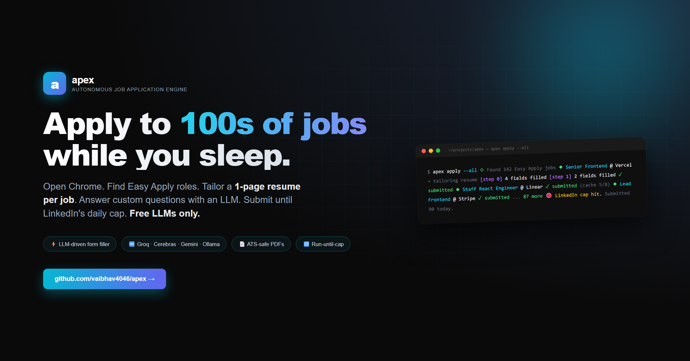

<div align="center">



# apex

### Autonomous job applications. Free LLMs. While you sleep.

[](LICENSE)
[](https://nodejs.org/)
[](https://www.typescriptlang.org/)
[](https://playwright.dev/)
[](#free-llm-providers)

</div>

---

apex opens Chrome, searches LinkedIn for Easy Apply roles, generates a **tailored 1-page resume per job**, fills out custom application questions with an LLM, and submits — autonomously, until LinkedIn's daily cap. Costs $0 with any free LLM provider.

<table>
<tr>
<td width="50%"></td>
<td width="50%"></td>
</tr>
<tr>
<td align="center"><sub><b>Real CLI run</b> — <code>apex resume</code></sub></td>
<td align="center"><sub><b>Tailored 1-page resume</b>, generated per job</sub></td>
</tr>
</table>

## Features

- **Autonomous Easy Apply** — opens real Chrome, drives LinkedIn end-to-end via Playwright
- **Per-job tailored resume** — markdown → ATS-safe PDF (Puppeteer), regenerated for each role
- **LLM form filler** — discovers fields, answers via profile → cache → LLM fallback. Handles custom questions (visa, salary, "why this company")
- **Pause-on-stuck UX** — required field with no confident answer? apex pauses, you finish, continues
- **Run-until-cap** — `--all` runs until LinkedIn's daily Easy Apply limit or rate-limit signals trigger graceful stop
- **Free LLMs only** — auto-router across Groq, Cerebras, Gemini, Ollama. Falls back on rate-limits
- **GitHub-aware** — pulls your top public repos via `gh` CLI to enrich resume context
- **Application history** — every submission logged with status + artifact paths at `~/.apex/`

## Quick start

```bash
git clone https://github.com/vaibhav4046/apex.git && cd apex
pnpm install
pnpm exec playwright install chrome

# 1. Add at least one free LLM key (any provider works):
echo "GROQ_API_KEY=gsk_..." > .env

# 2. One-time profile setup (~12 questions):
pnpm dev init

# 3. Rehearse without submitting:
pnpm dev apply -q "Senior Frontend" -n 5 --dry-run

# 4. Go live:
pnpm dev apply -q "Senior Frontend" -n 10
```

Once built (`pnpm build && npm link`), `apex` is global:

```bash
apex apply -q "Backend Engineer" --all      # until LinkedIn cap
apex history                                 # what was sent where
```

## Commands

| Command | What it does |
|---|---|
| `apex init` | Interactive profile builder (Clack prompts) |
| `apex resume --job-url <url>` | Tailored 1-page resume PDF |
| `apex cover --company X --role Y` | Cover letter PDF |
| `apex apply -q <query> [-n N \| --all]` | Autonomous LinkedIn Easy Apply |
| `apex history` | Submission log with status + paths |

### `apex apply` flags

| Flag | Default | Purpose |
|---|---|---|
| `-q, --query <text>` | first target role | Search query |
| `-l, --location <text>` | first target location | Location filter |
| `-n, --limit <num>` | `10` | Max applications (ignored if `--all`) |
| `--all` | off | Run until LinkedIn's daily Easy Apply cap |
| `--dry-run` | off | Generate resumes, skip submission |
| `--delay <ms>` | `2500` | Politeness delay between applications |
| `-y, --yes` | off | Skip confirmation (non-interactive) |

## Free LLM providers

apex auto-detects every configured provider and falls back across them on rate-limits.

| Provider | Free tier | Env var |
|---|---|---|
| [Groq](https://console.groq.com/keys) | ~14k req/day per model | `GROQ_API_KEY` |
| [Cerebras](https://cloud.cerebras.ai) | 1M tokens/day | `CEREBRAS_API_KEY` |
| [Gemini](https://aistudio.google.com/apikey) | 15 RPM Flash | `GEMINI_API_KEY` |
| [Ollama](https://ollama.com) | Local, no key | `OLLAMA_ENABLED=1` |

## Architecture

```
src/
├── index.ts                 # CLI entry (commander)
├── commands/
│   ├── init.ts              # Interactive profile builder
│   ├── resume.ts            # One-page tailored resume
│   ├── cover.ts             # Cover letter
│   ├── apply.ts             # Auto-apply orchestrator
│   └── history.ts           # Application log viewer
└── lib/
    ├── llm.ts               # Provider router w/ auto-fallback
    ├── pdf.ts               # Puppeteer markdown → ATS-safe PDF
    ├── github.ts            # gh CLI wrapper for repo discovery
    ├── browser.ts           # Persistent Chrome (channel: chrome)
    ├── jobs.ts              # LinkedIn search + Easy Apply driver
    ├── form-filler.ts       # Field discovery + LLM-driven answers
    ├── answer-cache.ts      # Q+A cache, reused across jobs
    └── store.ts             # Profile + applications JSON at ~/.apex
```

## How autonomous submission works

```
LinkedIn search ──► Job card ──► Easy Apply ──┐
                                              ▼
                          ┌─── discoverFields(page) ───┐
                          │   text · select · radio    │
                          │   checkbox · file · etc.   │
                          └────────────┬───────────────┘
                                       ▼
                          ┌─── answerField(field) ─────┐
                          │  1. Profile direct map     │
                          │  2. Q+A cache hit          │
                          │  3. LLM (free provider)    │
                          └────────────┬───────────────┘
                                       ▼
                          fillField → Next/Review/Submit
                                       │
                                       ▼
                       Detect rate-limit / cap signals
                                       │
                                       ▼
                              addApp(history.json)
```

## Honest limitations

- **2FA / CAPTCHA** — you log in once, Chrome state persists at `~/.apex/browser-state`. apex never bypasses challenges.
- **LinkedIn DOM drift** — selectors broaden with each LinkedIn re-skin; fixes ship as patches.
- **Indeed / Wellfound** — search drivers exist, Easy Apply submission is LinkedIn-only in v0.1.
- **Rate limits** — default 2.5s delay between submissions. With `--all`, apex auto-detects "daily limit" / "unusual activity" / "too many requests" signals and stops cleanly.

## Roadmap

- [x] LLM-driven form filler for custom application questions
- [x] Pause-on-question UX (notify user, resume after answer)
- [x] Real Chrome channel (not bundled Chromium)
- [x] Run-until-cap autonomous mode
- [ ] Indeed Easy Apply submission
- [ ] Wellfound (AngelList) support
- [ ] Resume A/B testing across roles
- [ ] Slack/email notifications for submissions
- [ ] Cron mode (daily applies)

## License

MIT © [vaibhav4046](https://github.com/vaibhav4046)

<div align="center"><sub>Built in TypeScript. Powered by free LLMs. Made for job seekers who want their evenings back.</sub></div>
